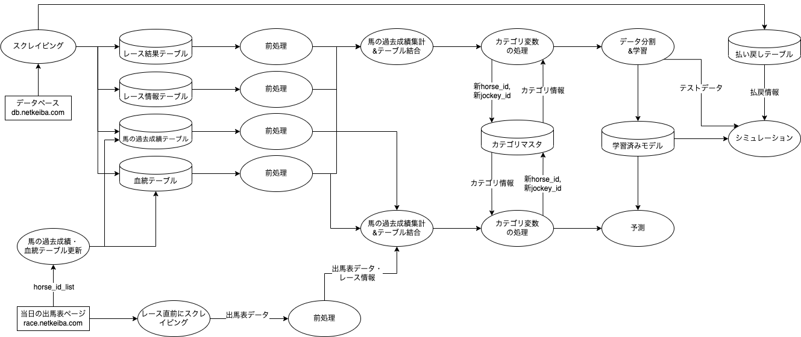
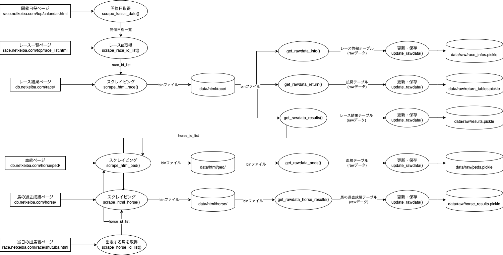

# keibaAI-v2
競馬予想AI v2のリポジトリ。
ソースコードの実行は、main.ipynbで行います。

# 環境
本リポジトリのコードは以下の環境で開発されました
- OS: MacOS 12.3.1
- IDE: Visual Studio Code 1.70.1
- 言語: Python 3.8.5

# 必要なライブラリをインストール
本リポジトリは以下のコマンドで必要なPythonライブラリをインストールします。
(wheelはlightbgmをインストールするために必要です。)
```
pip install wheel
pip install -r requirements.txt
```

# データフロー図
## 全体図


## preparing
スクレイピング部分の処理詳細


# ライセンス・免責事項
- レポジトリや書籍に掲載されているソースコードにつきまして、運営者の許諾なしにコンテンツの全部または一部を転載・再配布することはお控えください。
- ソースコードの加筆修正や、コミュニティ内における共有は可とします。
- ソースコード以外の共有（買い目や予測モデル構築ステップなど）につきましては、コミュニティ外部への共有であっても可とします。（その場合、書籍をご紹介いただけると幸いです。）
- 情報の正確さ、安全性の向上、不都合に対するサポートなどに対しては可能な限り力をいれておりますが、利用者が書籍やリポジトリを利用して生じた損害に関して、運営者は責任を負わないものとします。

# スクレイピング時の注意点
for文の中などで、複数ページに渡るスクレイピングを行う際は、**サーバーに負荷をかけないように1アクセスごとに必ず`time.sleep(1)`などで1秒間以上の待機時間を入れるようにしてください**。（[「健全なスクレイピング」だと判断](http://librahack.jp/wp-content/uploads/announcement-20110225.pdf)された[過去事例](http://librahack.jp/okazaki-library-case/stress-test-thinking.html)）
```python
for race_id in race_id_list:
    # 待機時間を入れる
    time.sleep(1)
    url = "https://db.netkeiba.com/race/" + race_id
    html = requests.get(url)
    # 以下省略
```

特に、自分でカスタマイズしてコードを書いている時などは、`time.sleep(1)`が抜けてしまわないようにスクレイピング前に確認をお願いします。（netkeiba.comはAkamaiというサービスを利用しており、悪質なスクレイパー扱いをされるとAkamaiを利用している他のサイトにも一時的にアクセスできなくなる場合があるようなので、注意しましょう。）


# 期間指定スクレイピング（修正版）
2010/01/01 〜 2026/04/12 のような**日付範囲**で開催日・race_idを取得できるようにしています。

## 実行例
```bash
python run_scrape_date_range.py --from-date 2010/01/01 --to-date 2026/04/12
```

### race HTML まで保存する場合
```bash
python run_scrape_date_range.py --from-date 2010/01/01 --to-date 2026/04/12 --download-race-html
```

## 出力先
- `data/tmp/kaisai_date_20100101_20260412.csv`
- `data/tmp/race_id_list_20100101_20260412.csv`

## 修正点
- `scrape_kaisai_date()` が `YYYY/MM/DD` / `YYYY-MM-DD` / `YYYYMMDD` / `YYYY/MM` / `YYYY-MM` を受付
- 終了月の途中日（例: `2026/04/12`）でも**4月分を取りこぼさず**取得
- 指定期間外の開催日を除外
- `scrape_race_id_list()` が途中CSV保存・エラー継続に対応


## 追加修正（2026-04-12 再修正版）

- `LocalPaths.BASE_DIR` を**実行場所ではなくプロジェクトルート基準**に修正
- `calendar` 取得に **User-Agent / timeout / retry** を追加
- `selenium` 未導入時に、`preparing` の import 全体が落ちにくいよう修正
- NumPy 環境差で起きる `from numpy import NaN` の import error を修正


# GitHub Actions 自動実行

## 追加ファイル
- `.github/workflows/scrape-date-range.yml`
- `scripts/resolve_scrape_range.py`
- `scripts/write_scrape_state.py`
- `.github/state/.gitkeep`

## 挙動
- **初回の自動実行のみ** `2010/01/01` から **当日(JST)** までの全期間を実行
- **2回目以降の自動実行** は `.github/state/initial_full_run.done` の存在を見て、増分実行へ切替
- 増分実行の開始日は `.github/state/last_successful_run_jst.txt` を基準に **1日ぶん重ねて** 取得
- 実行結果の CSV は GitHub Actions の **Artifacts** に保存
- 状態ファイルはリポジトリへ自動コミット

## 手動実行
Actions 画面から `scrape-date-range` を手動実行できます。
- `mode=auto` : 初回のみ全実行、以降は増分
- `mode=full` : 強制的に全実行
- `mode=incremental` : 強制的に増分実行
- `from_date` と `to_date` を両方入れると、その範囲を優先

## 定期実行時刻
- `cron: '17 20 * * *'`
- **UTC 20:17 = JST 05:17（毎日）**

## 補足
- GitHub Actions の runner に Chrome / ChromeDriver が入っている場合はそれを優先使用
- 見つからない場合のみ `webdriver-manager` で取得
- race HTML の大量保存は重くなるため、定期実行では通常オフにして手動実行時だけ使う想定
